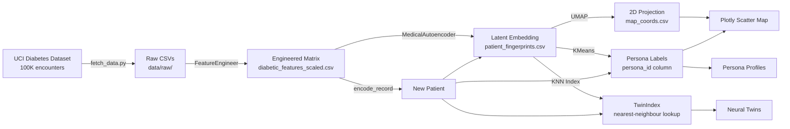

# Architecture

## System Overview



## Module Layout

```
src/personas/
├── __init__.py
├── config.py          # Settings dataclass — all hyperparameters
├── features.py        # FeatureEngineer (fit/transform/save/load)
├── data.py            # DataLoader (CSV loading, null-column dropping)
├── models.py          # MedicalAutoencoder + train_autoencoder()
├── clustering.py      # PatientClustering + TwinIndex (KNN on latent)
├── dimensionality.py  # DimensionalityReducer (UMAP wrapper)
├── artifacts.py       # ModelArtifacts save/load/manifest
├── pipeline.py        # run_pipeline() end-to-end orchestrator
├── inference.py       # encode_record() for new patients
└── evaluation.py      # Metrics, cluster sweeps, stability, profiles

app/
├── __init__.py
├── main.py            # FastAPI factory (lifespan, artefact loading)
├── state.py           # AppState dataclass (loaded once at startup)
├── schemas.py         # Pydantic request/response models
├── visualizer.py      # ClusterVisualizer (Plotly)
├── routes/
│   ├── map.py         # GET /map
│   ├── persona.py     # GET /persona/{id}
│   ├── twins.py       # GET /patient/{idx}/twins
│   └── encode.py      # POST /encode
└── static/
    └── index.html     # Interactive single-page UI

scripts/
├── fetch_data.py      # Download UCI dataset
├── run_pipeline.py    # End-to-end pipeline runner
└── evaluate.py        # Evaluation harness
```

## Data Flow

1. **Fetch**: `scripts/fetch_data.py` downloads the UCI dataset into `data/raw/`
2. **Pipeline**: `scripts/run_pipeline.py` orchestrates the full ML pipeline:
   - Loads raw CSVs → drops high-null columns → maps ICD-9 codes
   - Encodes ordinal/nominal features → MinMaxScaler → engineered matrix
   - Trains autoencoder (MSE + KL loss, early stopping on validation split)
   - Extracts latent fingerprints → UMAP projection → KMeans clustering
   - Saves all artefacts: model weights, encoder, scaler, manifest
3. **Serve**: `uvicorn app.main:app` loads artefacts once at startup, precomputes the Plotly map and persona statistics, then serves the API + interactive UI
4. **Inference**: POST `/encode` transforms a new patient record through the same FeatureEngineer → autoencoder → clusterer pipeline, then finds neural twins via the prebuilt KNN index

## Design Decisions

| Decision | Rationale |
|----------|-----------|
| Encoders saved via `torch.save` / `joblib` | PyTorch models need state_dict; sklearn transformers need joblib |
| `diabetic_features_scaled.csv` gitignored | 180 MB derived file; reproducible from raw via `make pipeline` |
| `TwinIndex` never refit at startup | Prebuilt once from committed fingerprints; stable and fast |
| Endpoints are synchronous | Simplifies state access; async adds no benefit for in-memory lookups |
| `create_app()` factory pattern | Enables testability and lifespan-managed resource loading |